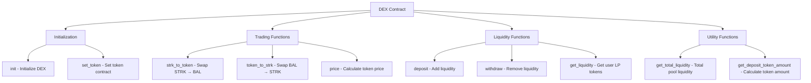
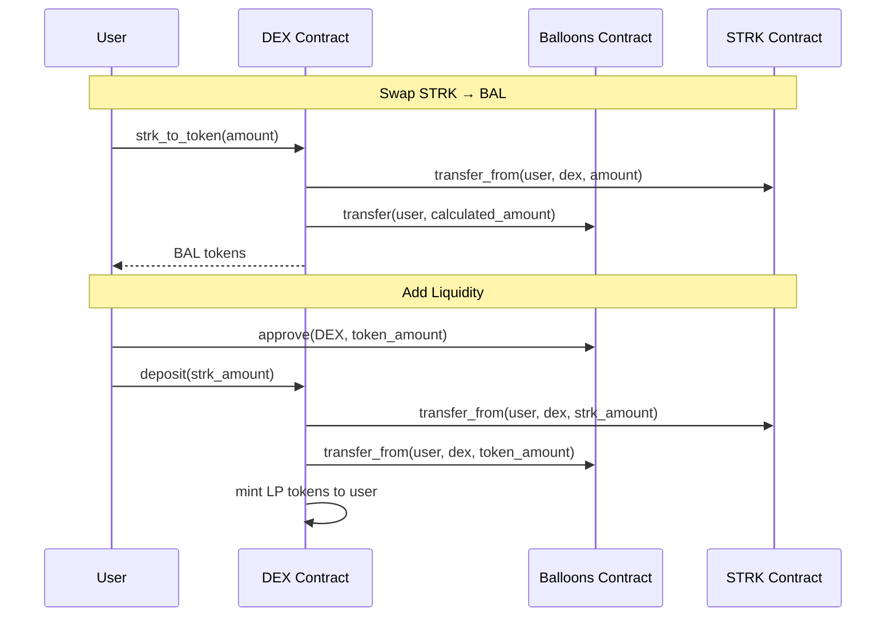
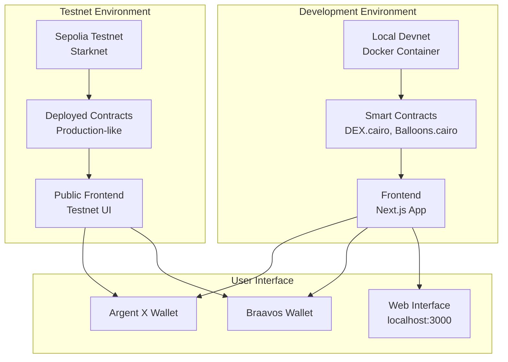
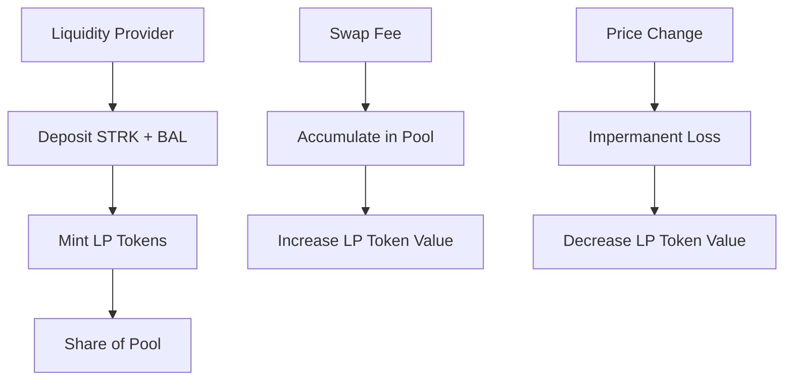
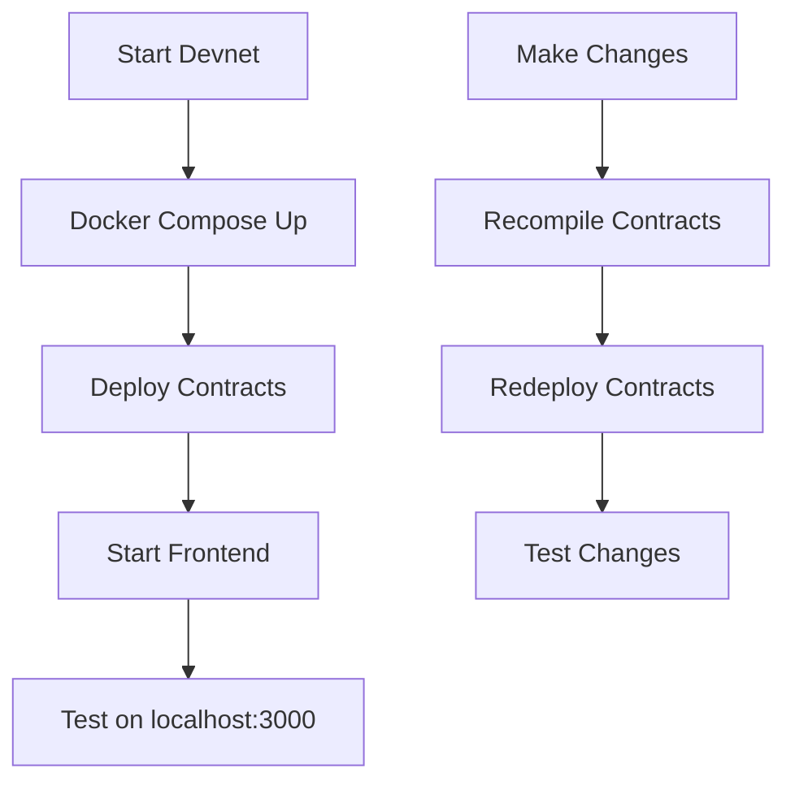
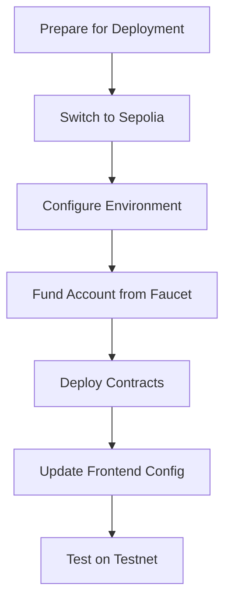

# 🏗️ DEX Architecture Documentation

## 🎯 **Tổng quan**

Dự án này xây dựng một Decentralized Exchange (DEX) trên Starknet blockchain, sử dụng Automated Market Maker (AMM) model với cặp token BAL ↔ STRK.

## 🏗️ **Kiến trúc hệ thống**

### **Core Components**

#### **1. Smart Contracts (Cairo)**
- **`DEX.cairo`**: Main DEX contract với AMM logic
- **`Balloons.cairo`**: ERC20 token contract (BAL)

#### **2. Frontend (Next.js)**
- **UI Interface**: Swap tokens, view balances, visualize slippage
- **Wallet Integration**: Argent X, Braavos
- **Real-time Updates**: Contract interactions

#### **3. Development Environment**
- **Starknet Devnet**: Local blockchain development
- **Docker**: Containerized devnet
- **Scaffold-Stark**: Development framework

## 🔄 **Smart Contract Architecture**

### **DEX Contract Functions**



### **Token Flow**



## 🌐 **Network Architecture**



## 📊 **AMM (Automated Market Maker) Logic**

### **Constant Product Formula**

```
x * y = k
```

Where:
- `x` = STRK reserves
- `y` = BAL token reserves  
- `k` = Constant product

### **Price Calculation**

```mermaid
graph LR
    A[Input Amount] --> B[Calculate Price Impact]
    B --> C[Apply Slippage]
    C --> D[Output Amount]
    
    B --> B1[Current Price = y/x]
    B --> B2[New Price = (y - Δy)/(x + Δx)]
    B --> B3[Slippage = (New Price - Current Price) / Current Price]
```

### **Liquidity Pool Mechanics**



## 🛠️ **Development Workflow**

### **Local Development**



### **Deployment Process**



## 📁 **Project Structure**

```
challenge-4-dex/
├── packages/
│   ├── snfoundry/           # Smart contracts & deployment
│   │   ├── contracts/
│   │   │   └── src/
│   │   │       ├── DEX.cairo
│   │   │       └── Balloons.cairo
│   │   ├── scripts-ts/      # Deployment scripts
│   │   └── .env             # Environment variables
│   └── nextjs/              # Frontend application
│       ├── app/
│       │   ├── dex/         # DEX interface
│       │   └── events/      # Transaction history
│       ├── contracts/       # Deployed contract addresses
│       └── scaffold.config.ts
├── notes/                   # Checkpoint documentation
├── todos/                   # Testing guides
├── docker-compose.yml       # Devnet configuration
└── Makefile                 # Development commands
```

## 🔧 **Key Commands**

### **Development**
```bash
# Start local devnet
make start-devnet

# Deploy contracts
make deploy

# Start frontend
make start

# Stop devnet
make stop-devnet
```

### **Testing**
```bash
# Run tests
yarn test

# Compile contracts
yarn compile
```

### **Deployment**
```bash
# Deploy to Sepolia
yarn deploy --network sepolia

# Deploy to Mainnet
yarn deploy --network mainnet
```

## 🌍 **Network Configuration**

### **Supported Networks**

| Network | RPC URL | Chain ID | Purpose |
|---------|---------|----------|---------|
| Devnet | http://127.0.0.1:5050 | Local | Development |
| Sepolia | https://starknet-sepolia.public.blastapi.io/rpc/v0_8 | SN_SEPOLIA | Testing |
| Mainnet | https://starknet-mainnet.public.blastapi.io/rpc/v0_8 | SN_MAIN | Production |

### **Environment Variables**

```bash
# Sepolia Configuration
PRIVATE_KEY_SEPOLIA=your_private_key
ACCOUNT_ADDRESS_SEPOLIA=your_account_address
RPC_URL_SEPOLIA=https://starknet-sepolia.public.blastapi.io/rpc/v0_8
```

## 🧪 **Testing Strategy**

### **Contract Testing**
- **Unit Tests**: Individual function testing
- **Integration Tests**: Contract interaction testing
- **Edge Cases**: Boundary condition testing

### **Frontend Testing**
- **UI Components**: React component testing
- **Wallet Integration**: Connection testing
- **Transaction Flow**: End-to-end testing

### **Network Testing**
- **Devnet**: Local development testing
- **Sepolia**: Testnet deployment testing
- **Mainnet**: Production deployment testing

## 📚 **Resources**

### **Documentation**
- [Starknet Documentation](https://docs.starknet.io/)
- [Cairo Book](https://book.cairo-lang.org/)
- [Scaffold-Stark](https://github.com/scaffold-stark/scaffold-stark)

### **Tools**
- [Starkli CLI](https://book.starkli.rs/)
- [Argent X Wallet](https://www.argent.xyz/)
- [Braavos Wallet](https://braavos.app/)

### **Faucets**
- [Starknet Sepolia Faucet](https://starknet-faucet.publicgoods.xyz/)
- [Alchemy Faucet](https://www.alchemy.com/faucets/starknet-sepolia)
- [Blast Faucet](https://blastapi.io/faucets/starknet-sepolia-eth)

## 🎯 **Checkpoints Completed**

- ✅ **Checkpoint 1**: Project structure & contract deployment
- ✅ **Checkpoint 2**: Contract initialization & token setup
- ✅ **Checkpoint 3**: Price calculation & AMM logic
- ✅ **Checkpoint 4**: Trading functions (swap)
- ✅ **Checkpoint 5**: Liquidity functions (deposit/withdraw)
- ✅ **Checkpoint 6**: Frontend UI & slippage visualization
- ✅ **Checkpoint 7**: Sepolia testnet deployment

## 🚀 **Getting Started**

1. **Clone repository**
2. **Install dependencies**: `yarn install`
3. **Start devnet**: `make start-devnet`
4. **Deploy contracts**: `make deploy`
5. **Start frontend**: `make start`
6. **Open browser**: http://localhost:3000

## 📄 **License**

MIT License - See LICENSE file for details.
